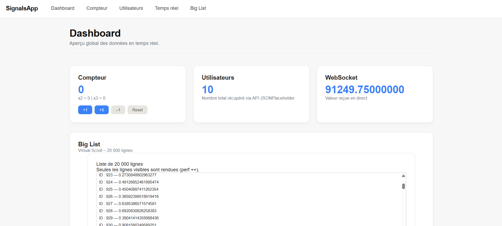

# 🔥 Angular Signals Dashboard — Demo App (Angular 19/20)

<p> 
 
 
 
 
 
</p>

Une application **Angular (Standalone + Signals)** moderne et professionnelle,
construite pour démontrer :

- la gestion d’état avec **Signals**
- les stores réactifs
- la communication temps réel via **WebSocket**
- les performances (Virtual Scroll maison)
- une architecture claire **features / shared / core**
- un design Dashboard premium (style Linear / Stripe)
- Ce projet me sert de **laboratoire technique** et de **portfolio Angular avancé.**

---

## 🌟 Démo (screenshots)



---

## 🚀 Technologies & Concepts utilisés
Frontend

- Angular 20 (Standalone Components)
- Angular Signals : signal, computed, effect
- HttpClient
- RxJS (WebSocketSubject)
- Web Workers
- Virtual Scroll maison (20 000 items)
- SCSS global + design Dashboard premium

---

## 🧱 Architecture
```bash
app/
    core/
        workers/    
    shared/
        ui/
        stores/
    features/
        counter/
        users/
        dashboard/
        realtime/
        big-list/
```

---

## 📦 Installation & lancement
```bash
git clone <repo-url>
cd angular-signals-dashboard
npm install
ng serve
```

Application :
👉 http://localhost:4200/

---

## 🧭 Navigation principale

La navbar donne accès aux pages suivantes :

**📊 Dashboard**
- Vue d’ensemble du state global
- Compteur Signals
- Dernière valeur WebSocket
- Nombre d’utilisateurs
- Virtual Scroll intégré

**➕ Counter**
- Store Signals complet :
- count
- computed : doubled, tripled
- isEven
- lastChange
- actions : increment, decrement, reset…

**👥 Users**
- Chargement HTTP (jsonplaceholder)
- Signals store : loading, error, users, selectedUser
- Page détail utilisateur dynamique (URL param)

**⚡ Temps réel**
- WebSocket via RxJS
- Stabilisation via Signals
- Dernière valeur reçue

**📜 Big List**
- Virtual scroll haute performance (20 000 items)
- Mise à jour en continu via interval
- Calcul en Signals (startIndex, endIndex, visibleItems)

---

## 🧩 Stores Signals (exemple)
```bash
@Injectable({ providedIn: 'root' })
export class CounterStore {
private \_count = signal(0);
private \_lastChange = signal<Date | null>(null);

readonly count = computed(() => this.\_count());
readonly doubled = computed(() => this.\_count() _ 2);
readonly tripled = computed(() => this.\_count() _ 3);
readonly isEven = computed(() => this.\_count() % 2 === 0);

increment() {
this.\_count.update(n => n + 1);
this.\_lastChange.set(new Date());
}
}
```

---

## 🎨 UI / UX

Design inspiré des SaaS modernes :

- Navbar minimaliste
- Composant PageHeader réutilisable
- Cards premium (hover, ombre, arrondis)
- Typographie Inter
- Layout centré (.container)
- Grilles responsive

---

## 📚 Objectifs pédagogiques

Ce projet m’a permis de pratiquer :

- Signals & dérivations d’état
- Architecture scalable
- WebSocket temps réel (RxJS + Signals)
- Virtual Scroll performant
- Web Workers Angular
- Standalone Components
- UI Dashboard professionnelle
- Stores type “Zustand/Ngrx but Signals”

---

## 📌 Améliorations futures

- Mode Dark / Light
- Charts (ECharts, ngx-charts)
- Auth Firebase
- Skeleton loaders
- Tests unitaires (Jest)
- Lazy loading avancé

---

## 👤 Auteur

**Brenda Meynier**
Développeuse Angular / Python • Freelance

🔗 LinkedIn : https://www.linkedin.com/in/brenda-m-829ab978/

---

## ⭐ Soutenir le projet

Si ce projet t’a inspiré, **laisse une étoile ⭐ sur le repo GitHub !**
